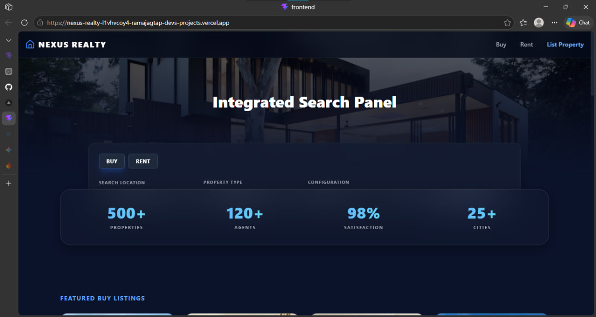
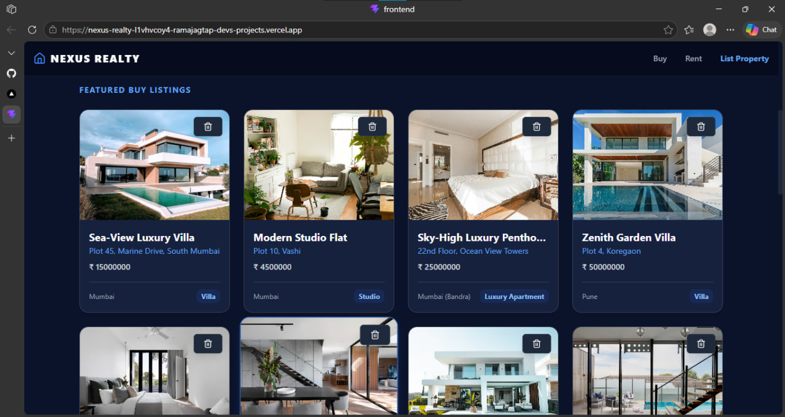
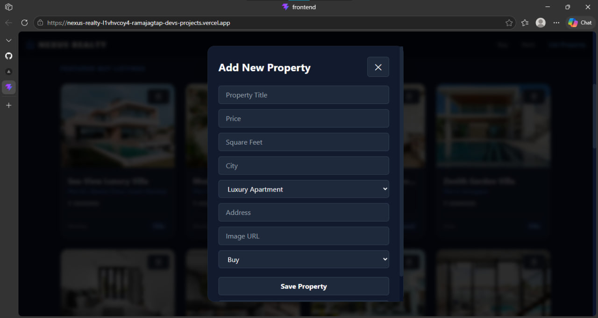
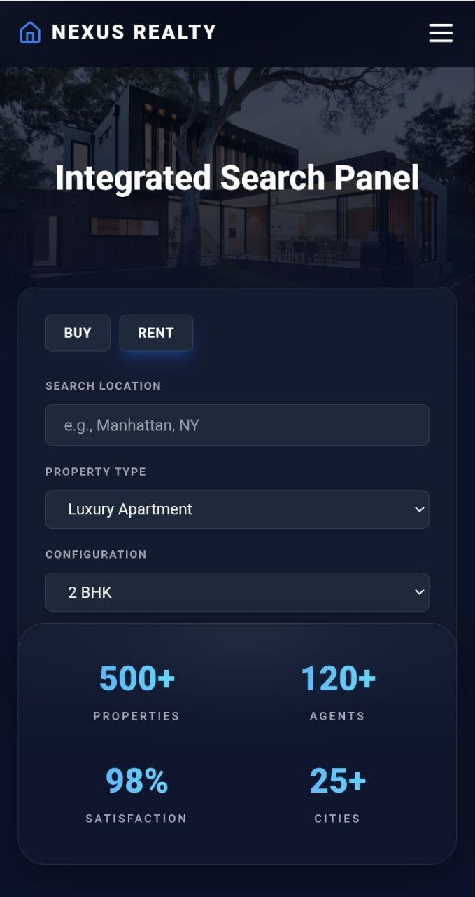

# 🏠 Nexus Realty

Nexus Realty is a modern real estate web platform built using React.js, Vite, Tailwind CSS, and Firebase.  
The platform is designed to simplify property browsing, listing, and management with a clean UI and smooth user experience.

---

## 🚀 Live Demo

🌐 Live Website:  
https://nexus-realty-git-main-ramajagtap-devs-projects.vercel.app/

---

## ✨ Features

- 🔍 Browse real-time property listings
- 🔐 Firebase Authentication (Login/Signup)
- 📦 Firestore database integration
- 🎨 Modern responsive UI with Tailwind CSS
- ⚡ Fast performance using Vite
- ✨ Smooth animations using Framer Motion
- 🔔 Interactive notifications with React Toastify
- 📱 Mobile-friendly design

---

## 🛠 Tech Stack

### Frontend
- JavaScript
- React.js
- Vite
- Tailwind CSS

### Backend / Database
- Firebase Authentication
- Firebase Firestore

### Libraries & Tools
- Framer Motion
- Lucide React
- React Toastify

### Deployment
- Vercel

---

## 📂 Project Structure

```text
nexus-realty/
├── frontend/
│   ├── src/
│   ├── public/
│   ├── vite.config.js
│   └── package.json
└── README.md
```

---

## ⚙️ Local Setup

### 1️⃣ Clone Repository

```bash
git clone https://github.com/ramajagtap-dev/nexus-realty.git
```

### 2️⃣ Navigate to Frontend

```bash
cd nexus-realty/frontend
```

### 3️⃣ Install Dependencies

```bash
npm install
```

### 4️⃣ Start Development Server

```bash
npm run dev
```

### 5️⃣ Build for Production

```bash
npm run build
```

---

## 🌐 Deployment Configuration

### Vercel Settings

```text
Root Directory: frontend
Build Command: npm run build
Output Directory: dist
```

---

## 📸 Screenshots

## 📸 Screenshots

### 🏠 Homepage



---

### 🏘 Property Listings



---

### 📄 Property Details



---

### 📱 Mobile Responsive View



---

## 👨‍💻 Author

### Rama Jagtap

🔗 GitHub:  
https://github.com/ramajagtap-dev
